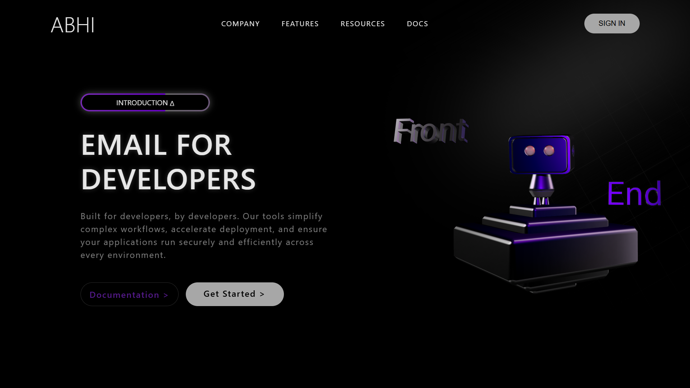

# 🌌 3D Web App

 
 
 
 

An experimental **3D landing page** built with **HTML, CSS, AOS animations, and Spline 3D models**.  
This project was created to **practice CSS fundamentals, animation basics, and 3D integration** on the web.  

---

## 📸 Preview

  
 

---

## ✨ Features

- 🎨 Modern **gradient background** and sleek UI design  
- ⚡ **Scroll-based animations** powered by [AOS](https://michalsnik.github.io/aos/)  
- 🦾 Embedded **interactive 3D robot model** using [Spline](https://spline.design/)  
- 📱 **Responsive layout** for desktop, tablet, and mobile  
- 🧩 Clean and smooth **navigation bar + buttons**  

---

## 🛠️ Tech Stack

- **HTML5**  
- **CSS3** (Flexbox, Media Queries, Animations)  
- **AOS (Animate On Scroll)**  
- **Spline Viewer**  

---

## 🌐 Live Demo

Check out the live version of this 3D Web App by clicking the link below:

)

